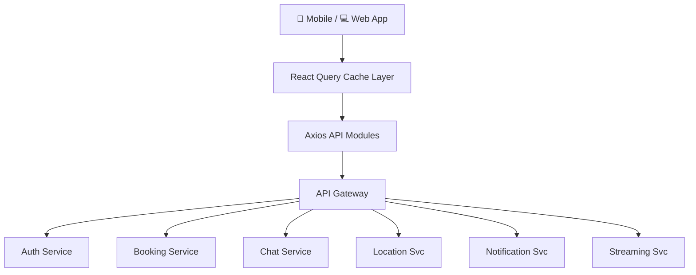
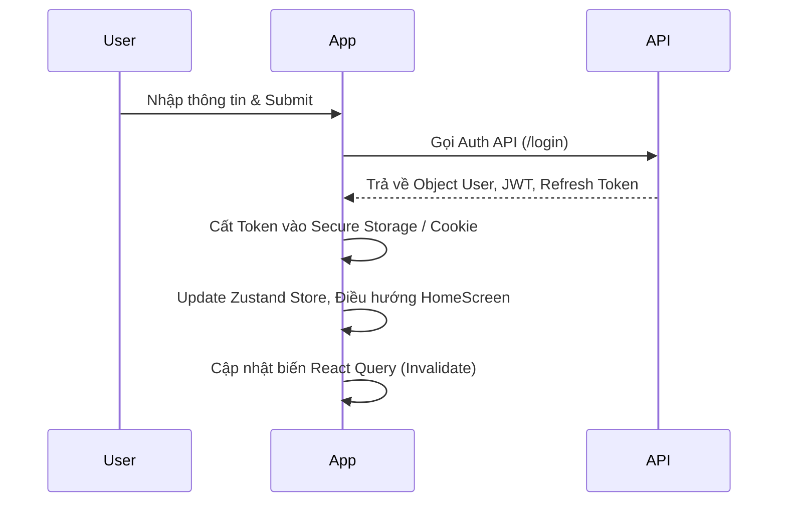
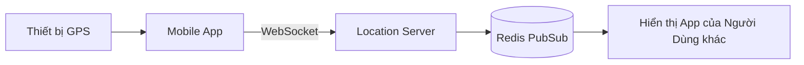
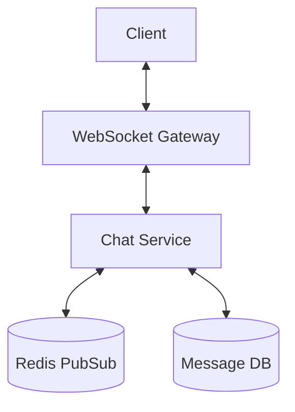
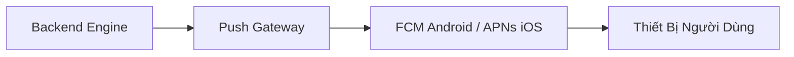
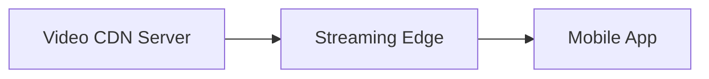
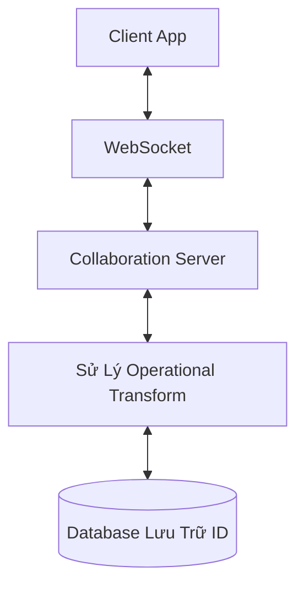

# Technical Design Document (TDD): React Native Golf Management App

Tài liệu thiết kế chức năng (High Level + Technical Design) cho ứng dụng quản lý sân Golf đa nền tảng. Hệ thống hỗ trợ Mobile, Web, và Tablet (Responsive). Đặc biệt, thiết kế UI/UX sử dụng tông màu **XANH LÁ (GREEN)** làm chủ đạo, thể hiện tinh thần thể thao đẳng cấp và thiên nhiên của bộ môn Golf.

---

## 1. Tổng quan hệ thống (System Overview)

### 1.1 Platform & Responsive
Ứng dụng được thiết kế đa nền tảng với một base code duy nhất, tự động thích ứng cấu trúc hiển thị tùy theo thiết bị:
- **Mobile (iOS & Android):** Tối ưu hóa cho điện thoại, trải nghiệm thao tác một tay với Bottom Tab.
- **Tablet / iPad:** Tận dụng không gian màn hình lớn để hiển thị Split View (chia cột).
- **Web (React Native Web):** Tối ưu cho trình duyệt máy tính, giao diện Sidebar và hỗ trợ phím/chuột.

**Framework sử dụng:**
- **Expo** (Managed + Bare workflow)
- **React Native** + **React Native Web**
- **TypeScript**

### 1.2 Tech Stack
| Layer | Technology |
|-------|------------|
| **UI & Styling** | React Native, NativeWind (TailwindCSS) / Styled Components |
| **Shared UI (tham chiếu thiết kế)** | **shadcn/ui** — nguyên tắc component, variant, token và accessibility làm chuẩn cho `components/ui` |
| **State** | Zustand |
| **API Request** | REST API + Axios (Modularized) |
| **Data Fetching** | React Query |
| **Form & Validations** | React Hook Form + Zod / Yup |
| **Messaging** | React Native Toast Message / Custom Alert Dialog |
| **Animation** | React Native Reanimated |
| **Navigation** | React Navigation |
| **Image** | `react-native-fast-image` |
| **BLE** | `react-native-ble-plx` |
| **Crash Monitoring**| Sentry |
| **CI/CD** | Expo Application Services (EAS) + Fastlane |

### 1.3 React Native New Architecture
Sử dụng kiến trúc mới của React Native để tối đa hóa hiệu năng:

| Technology | Purpose |
|------------|---------|
| **JSI** | Loại bỏ Bridge bottleneck (nút thắt cổ chai). |
| **TurboModules** | Tối ưu hóa tốc độ gọi Native Module. |
| **Fabric** | Cho phép Concurrent rendering (render đồng thời). |

> **Lưu ý:** Các module native yêu cầu hiệu suất cao như **BLE**, **Map**, và **Video streaming** sẽ chạy qua JSI / TurboModules để giảm triệt để độ trễ.

---

## 2. Kiến trúc hệ thống (System Architecture)

Luồng dữ liệu tổng quan của hệ thống:



---

## 3. Cấu trúc mã nguồn (Source Code Architecture)

Dự án **golf-manager** dùng **Expo Router** (file-based routing). **Không dùng thư mục `src/`** — toàn bộ mã nguồn tổ chức trong **app/** (Expo Router) và các thư mục ở **root** (components, services, stores, …).

### 3.1 Cấu trúc chuẩn (golf-manager)

```text
golf-manager/
├── app/                           # Expo Router – Định tuyến & khởi tạo app
│   ├── _layout.tsx                # Root layout (Providers, Theme, Stack)
│   ├── (auth)/                    # Nhóm route Auth (Stack)
│   │   ├── _layout.tsx
│   │   ├── login.tsx
│   │   ├── register.tsx
│   │   └── forgot-password.tsx
│   ├── (tabs)/                    # Nhóm Tab (Bottom Tab / Sidebar)
│   │   ├── _layout.tsx
│   │   ├── index.tsx              # Home
│   │   ├── map.tsx
│   │   ├── booking.tsx
│   │   ├── feed.tsx
│   │   └── profile.tsx
│   └── modal.tsx                  # Modal phủ (BookingDetail, Chat…)
│
├── config/                        # env.ts (API_BASE_URL, WS_URL), theme.ts (Spacing, BorderRadius)
├── providers/                     # QueryProvider, AppProviders (Toast)
├── components/                    # UI dùng chung — shadcn/ui (file kebab-case trong ui/)
│   ├── ui/                        # button, input, label, card, text, view, collapsible, icon-symbol…
│   ├── layout/                    # screen-container, keyboard-avoiding (vỏ màn hình)
│   ├── navigation/              # haptic-tab (tab bar)
│   ├── patterns/                # parallax-scroll-view, hello-wave (mẫu / demo)
│   └── links/                   # external-link
│
├── features/                      # Khối tính năng (logic, form, màn con)
│   ├── auth/                      # LoginForm, RegisterForm…
│   ├── booking/
│   ├── feed/
│   ├── chat/
│   ├── map/
│   └── streaming/
│
├── services/                      # Kết nối ngoại vi
│   ├── api/                       # apiClient, authAPI, bookingAPI
│   ├── websocket/
│   └── push/
│
├── stores/                        # Trạng thái toàn cục (Zustand)
├── hooks/                         # useColorScheme, useThemeColor, useDebounce…
├── utils/                         # formatDate, formatPhone…
├── validations/                   # Schema Zod / Yup (auth, booking…)
├── constants/                     # theme.ts (Colors, Fonts) – dùng chung
├── assets/
├── app.json
├── package.json
└── tsconfig.json                  # Path alias: @/* → ./*
```

### 3.2 Quy ước Expo Router trong `app/`

| Trong `app/` | Ý nghĩa |
|--------------|--------|
| `_layout.tsx` | Layout cho nhóm (Stack, Tab, Drawer). |
| Thư mục `config/`, `providers/` ở root | Không nằm trong `app/` để tránh Expo Router coi là route. |
| `(auth)/`, `(tabs)/` | Route group `(…)` → không thêm tên vào URL. |
| `modal.tsx` | Route `/modal`; có thể mở dạng presentation modal. |

### 3.3 Import

- Dùng alias **`@/*`** trỏ về thư mục gốc: `@/components/...`, `@/services/api/...`, `@/stores/...`, `@/config/...`, `@/providers/...`.
- Không dùng `src/`; mọi import đều từ root (ví dụ `@/features/auth/LoginForm`).

---

## 4. Hệ thống Thiết kế và Giao diện (Design System & Layout)

### 4.1. Phong cách thiết kế (Concept)
- **Tông màu chủ đạo (Primary Theme):** **XANH LÁ CÂY (GREEN)**. Mang lại cảm giác sang trọng, thể thao, hòa hợp với thiên nhiên.
- Dải màu kết hợp từ **Dark Green** (cho Header, Button) đến **Light Green** (Nền, Highlight), kết hợp không gian trắng (Whitespace) tạo độ thoáng cho App.
- UI dùng phong cách **Flat Design** với các góc bo tròn (Rounded corners) mềm mại và đổ bóng (Shadow) nhẹ để phân lớp nổi bật.

### 4.2. Cấu trúc Layout (Layout Structure)
- Bố cục 100% linh hoạt dựa vào hệ thống `Flexbox` của Yoga Layout.
- Sử dụng các layout wrapper chuẩn: `ScreenContainer` (tích hợp SafeAreaView), `KeyboardAvoidingWrapper` (xử lý bàn phím đè UI); thẻ nội dung dùng `Card` trong `components/ui`.
- Thiết kế thích ứng mượt mà qua các Breakpoints: màn hẹp (Mobile), màn trung bình (Tablet), màn rộng (Web). (Hỗ trợ theo `% Width` hoặc cơ chế Grid của Tailwind).

### 4.3. Quản lý Styling
- Sử dụng **NativeWind** (TailwindCSS cho React Native) hoặc **Styled Components**.
- Tạo sẵn các Utility-first class giúp đồng bộ UI giữa các nền tảng dễ dàng, cấu trúc mã CSS gọn gàng, ít lặp lại.

### 4.4. UI Component Architecture & Shared UI (shadcn/ui)
- **UI dùng chung (Shared UI)** được thiết kế dựa trên **[shadcn/ui](https://ui.shadcn.com/)**: cùng triết lý component có thể compose, API theo **variant** (class-variance-authority / tương đương), tách **primitive** và **styled layer**, và chú trọng accessibility — giữ đồng bộ với hệ sinh thái Tailwind/NativeWind đã chọn.
- Trên **Web (React Native Web)** có thể tái sử dụng hoặc song song các block shadcn khi phù hợp; trên **iOS/Android** triển khai các component tương đương trong `components/ui` (React Native primitives + NativeWind) nhưng **bám tên, cấu trúc thư mục và hành vi** theo shadcn để team chỉ cần một “nguồn sự thật” về UI.
- Áp dụng **Atomic Design**: mọi element nhỏ nhất (`Button`, `Input`, `Label`, `Card`, `Dialog`, `Icon`…) nằm tại `components/ui` và được lắp ghép (compose) cho màn hình — không nhân bản style ad-hoc ngoài hệ thống.

---

## 5. Cấu trúc API Modules (API Modularization)

Để ứng dụng dễ dàng bảo trì và quản lý Endpoints:

### Tầng Axios Interceptors
- **Request:** Tự động gắn header `Authorization: Bearer <JWT Token>`.
- **Response:** Cấu hình cơ chế **Refresh Token ngầm**. Khi nhận lỗi HTTP `401 Unauthorized`, tự động gọi API lấy Token mới và thực hiện lại các request đang pending mà không làm gián đoạn trải nghiệm người dùng.

### Tầng API Modules
Chia file API theo từng thực thể nghiệp vụ, ví dụ `services/api/bookingAPI.ts`:
```typescript
import apiClient from './apiClient';

export const BookingAPI = {
  getSlots: (courseId: string) => apiClient.get(`/courses/${courseId}/slots`),
  bookHole: (data: BookingPayload) => apiClient.post(`/bookings`, data),
  cancel: (bookingId: string) => apiClient.delete(`/bookings/${bookingId}`)
};
```

---

## 6. Validation Form & Messaging (Xác thực và Thông báo)

### 6.1. Form Validate
- Tích hợp **React Hook Form** cùng với Schema Builder **Zod** (hoặc **Yup**).
- Kiểm tra tính hợp lệ dữ liệu "As you type" trực tiếp trên Client (Email, Passwords, Phone...) mà không cần chờ Server phản hồi. Tối ưu UX/hiệu năng.

### 6.2. Hệ thống Message & Toast
- Người dùng được cung cấp **Feedback tức thì** cho mọi hành động (Đặt sân thành công, Lỗi mạng...).
- Trạng thái sẽ kích hoạt **Toast Messages** nổi hoặc **Alert Dialog**:
  - `Success`: Nền Trắng, Icon/Viền **Xanh Lá Cây (Green)**.
  - `Error`: Nền Trắng, Icon/Viền **Đỏ (Red)**.
  - `Info/Warning`: Màu Xanh Dương hoặc Vàng tương ứng.

---

## 7. Kiến trúc Điều hướng (Navigation Architecture)

Sử dụng **React Navigation** đa nền tảng:

```text
Root Navigator
├── Auth Stack
│   ├── Login
│   ├── Register
│   └── ForgotPassword
├── Main Tab (Bottom Tab cho Mobile / Sidebar cho Web)
│   ├── Home
│   ├── Map
│   ├── Booking
│   ├── Feed
│   └── Profile
└── Modal Stack (Màn hình phủ lên Main screen)
    ├── BookingDetail
    ├── Chat
    └── Notifications
```

---

## 8. Thiết kế Hệ thống Xác thực (Authentication System)

### Chiến lược Lưu trữ (Storage Strategy)
- **Mobile:** `SecureStore` (Lưu trữ mã hóa sâu vào lớp hệ điều hành).
- **Web:** Bắt buộc sử dụng `httpOnly cookie` để chặn đứng các tấn công XSS.
- **Global State:** Thông tin User Auth được giữ trong store của **Zustand**.

### Luồng Đăng nhập (Login Flow)


---

## 9. Chiến lược Fetching Dữ liệu (Scalable API Data Fetching)

Sử dụng **React Query** mạnh mẽ:
- ✅ **Caching:** Không gọi lại API nếu dữ liệu chưa hết hạn mức Stale time.
- ✅ **Retry ngầm định:** Tự động retry gọi lại (3-5 lần) khi rớt mạng ngẫu nhiên.
- ✅ **Background Refetch:** Lấy dữ liệu mới nhất ngầm định mỗi khi mở lại App/Screen.
- ✅ **Optimistic Update:** Cập nhật ngay UI (VD: Tim bài viết) trước khi chờ API Server trả về thành công.

---

## 10. Thiết kế Offline First

Giúp App bền bỉ khi mất mạng trên sân Golf (vùng phủ sóng kém):

| Layer | Strategy |
|-------|----------|
| **Local Cache** | React Query Cache Storage |
| **Local DB** | SQLite Database cho nền tảng Mobile |
| **Sync Queue** | Background worker lưu trữ và đẩy tác vụ đồng bộ khi có Mạng trở lại |

**Luồng đồng bộ (Sync Flow):**
1. Người dùng làm thao tác mới (VD: Báo điểm/Ghi chú).
2. Lưu thẳng vào **Local DB** SQLite nội bộ.
3. Bản ghi được đưa vào **Sync Queue**.
4. Khi OS báo thiết bị **Online**, Background worker đẩy dữ liệu lên Server lên tục.

---

## 11. Bản đồ Điều hướng Offline (Offline Map Navigation)

- **Vector Map:** Tải trước định dạng Vector tile xuống bộ nhớ hệ thống.
- **Thư viện:** Mapbox SDK.
- **Tính năng:**
  - Định vị bản đồ sân trong điều kiện Offline.
  - Vẽ tuyến điều hướng (Hole navigation).
  - Tracking theo dõi khoảng cách ngắm hướng (Distance tracking).

---

## 12. Tracking Vị trí Thời gian thực (Real-time Location Tracking)

Cập nhật vị trí của người chơi / xe buggy liên tục với tần suất `1–5 seconds`.



---

## 13. Hệ thống Chat Thời gian thực (Real-time Chat System)

Sử dụng WebSocket truyền thông tốc độ cao.

### Tính năng lõi:
- Chỉ báo đang soạn tin (Typing indicator).
- Xác minh đã đọc (Read receipt).
- Căn bản Media Upload (Đính kèm ảnh, clip).



---

## 14. Hệ thống Đặt chỗ (Booking System)

### Luồng Đặt chỗ (Booking Flow)
```text
[Chọn Sân Golf] 
  ➔ [Chọn Thời gian/Slot] 
  ➔ [Kiểm Tra Tình Trạng Slot] 
  ➔ [Giữ Chỗ Tạm Thời (Redis Lock)] 
  ➔ [Xử Lý Thanh Toán (Payment Gateway)]
```
> **Cực kỳ quan trọng:** Đảm bảo sử dụng **Redis Lock** cho bước *Giữ Chỗ Tạm Thời*, bảo vệ tuyệt đối tình trạng Overbooking (đặt trùng cùng lúc nhiều người).

---

## 15. Hệ thống Push Notification

Thông qua FCM/APNs Provider:
- Xác nhận đặt sân (Booking confirmed).
- Chat message.
- Thông báo giải đấu, quảng bá hệ thống (System Config/Promotion).



---

## 16. Mạng Xã Hội Golf (Feed Phong Cách Instagram)

Hỗ trợ chia sẻ mạng lưới nội bộ cộng đồng người chơi:
- **Cấu trúc thực thể:** Bài đăng (Post), Ảnh (Media), Lượt thích (Likes), Bình luận (Comments).
- **Phân trang vô tận:** Xử lý hiệu năng ưu việt nhờ **Cursor-based Pagination**.
- Giao diện tối ưu dùng `FlatList` với thuộc tính windowSize tiết kiệm bộ nhớ.

---

## 17. Trình Cuộn Video Feed (Phong Cách TikTok / Reels)



- Trình phát với thanh trượt vuốt dọc mượt mà (Vertical paging).
- **Autoplay** thông minh dựa vào độ focus màn hình.
- **Preload** sẵn video tiếp theo để trải nghiệm không gián đoạn.

---

## 18. Phát nhạc / Audio Phong cách Spotify

- **Giao thức tải phát:** Hệ HLS (HTTP Live Streaming).
- Cung cấp cơ chế **Background Playback**: Không gián đoạn khi khóa màn hay thoát App.
- Điều khiển Playlist cá nhân.
- Download Caching cho chế độ Offline.

---

## 19. Phân hệ Phóng Sự Trực Tiếp (Livestreaming App)

- **WebRTC:** Được chọn cho công đoạn quay trực tiếp nhằm độ trễ thấp nhất.
- **HLS Streaming:** Phương thức phát tán băng thông cho khán giả theo dõi từ xa theo luồng Broadcast CDN.

---

## 20. Chỉnh sửa Đồng bộ Thời gian thực (Collaborative Editing)

Áp dụng lý thuyết **Operational Transform** để cập nhật cùng lúc bảng tin giải đấu/hội nhóm:



---

## 21. Tối ưu Hiệu năng React Native (Performance Optimization)

- **Memoization Component:**
  - `React.memo` bọc các component tĩnh.
  - `useMemo` và `useCallback` tránh tạo lại đối tượng và function qua các lần render.
- **Normalize State:** Chuyển trạng thái Array Object thành dạng Maps Hash (Dictionary), tăng vượt trội tốc độ truy xuất lookup thay vì O(n).
- **Split Component:** Không viết file component quá 300 dòng; tách ListItem, CardHeader, Avatar... lẻ lẻ.
- Tối đa dùng thẻ `getItemLayout` của mảng FlatList nếu danh sách có độ cao linh kiện cố định.

---

## 22. Hệ thống Giám sát & Quan trắc (Monitoring & Observability)

Tích hợp SDK sâu vào Frontend/Backend phân tích log.
- Trình bắt lỗi ứng dụng: **Sentry**.
- Theo dõi các KPI Cốt lõi: Crate rate (khả năng crash hệ thống), API Latency.

---

## 23. Quy trình CI/CD Pipeline Thiết Kế Vận Hành Tự Động

Chuỗi pipeline hoàn toàn tự động lên hệ sinh thái của AppStore và Google PlayStore.

```mermaid
flowchart LR
    Git[GitHub Platform] --> CI[Kiểm tra chất lượng (Lint, Tests)]
    CI --> EAS[Kho build EAS Cloud]
    EAS --> Fastlane[Deploy Automation Fastlane]
    Fastlane --> Store[Live trên Cửa Hàng]
```

---

## 24. Thiết kế Tiêu chuẩn Bảo mật (Security Design)

| Target | Security Method |
|-------|----------|
| **Xác thực API** | Giải thuật JWT phân rã và hạn Refresh Token ngắn. |
| **Bảo vệ Gateway** | Rate limit, Burst limit để tránh DDOS Endpoint. |
| **Lưu trữ nhạy cảm** | Keychain trên iOS, Keystore trên Android. |
| **Tunnel Network**| SSL / HTTPs kết hợp WSS cho Socket an toàn. |

---

## 25. Tối ưu Tải hình ảnh (Image Loading Optimization)

Với ứng dụng mạng cộng đồng chứa rất nhiều ảnh động và video, **bắt buộc** dùng plugin Native: `react-native-fast-image`.
- Cấu hình tải thông minh **Image Priority**.
- Tự động dọn dẹp bộ nhớ RAM khi vượt tải.
- Caching cứng dưới thư mục vật lý thiết bị.

---

## 26. Kết nối Dữ liệu Cảm biến (BLE Streaming Data)

**Ứng dụng:** Kết nối đo vòng cung quỹ đạo quay gậy Golf/Buggy qua Bluetooth nội vùng.
**Thư viện:** Dùng `react-native-ble-plx`.

```text
[Thiết Bị Cảm Biến BLE] 
  ➔ [Truy Cập Quét Bluetooth Mobile] 
  ➔ [Chập Luồng Thông Điệp Stream] 
  ➔ [Engine Giải Mã Chuỗi Binary] 
  ➔ [Vẽ Biểu Đồ Analytics Chỉ Số Thể Lực]
```

---

## 27. Chỉ tiêu Hiệu năng (Performance Benchmarks Profile)

Phải luôn duy trì chỉ số hệ thống ở mức sau trong suốt vòng đời của dự án:

| Tiêu chuẩn đo lường (Metric) | Mức Kỳ Vọng (Goal Target) |
|--------------------|-------------|
| **Khởi động từ số 0 (Cold Start)** | `< 2s` |
| **Cam kết mật độ khung hình** | Ổn định `60fps` liên tục |
| **Phản hồi hệ thống mạng** | Hoàn thành `< 200ms` |

---
*Tài liệu Hệ thống (TDD): Version 1.1 - Cập nhật kiến trúc hệ phân lớp mã nguồn, UI Framework, và Design Layout tập trung trên mọi nền tảng thiết bị với concept màu Xanh chủ đạo.*